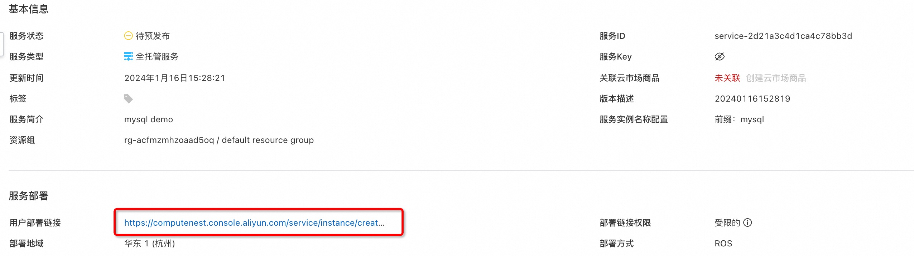

# 服务模板说明文档

## 服务说明

本文介绍基于MySQL软件包快速构建托管版单租户计算巢服务，关于计算巢托管版可以参考[帮助文档](https://help.aliyun.com/zh/compute-nest/create-a-fully-managed-service?spm=a2c4g.11174283.0.i5)，
本示例采用单ECS的架构，并默认开启了VPC对等连接，用户部署服务实例后，可以直接通过内网访问部署在服务商的MySQL，除此之外还配置了三种套餐，分别为：

| 套餐名 | ECS规格族         | vCPU与内存          | 系统盘               | 公网带宽      |
|-----|----------------|------------------|-------------------|-----------|
| 低配版 | ecs.u1-c1m2.large   | 内存型c6，2vCPU 4GiB | ESSD云盘 200GiB PL0 | 固定带宽1Mbps |
| 基础版 | ecs.u1-c1m2.xlarge  | 内存型c6，4vCPU 8GiB | ESSD云盘 200GiB PL0 | 固定带宽1Mbps |
| 高配版 | ecs.u1-c1m2.2xlarge | 内存型c6，4vCPU 8GiB | ESSD云盘 200GiB PL0 | 固定带宽1Mbps |

本示例对应的Git仓库地址：[mysql-managed-vpcpeering-demo](https://github.com/aliyun-computenest/mysql-managed-vpcpeering-demo)

本示例会自动的构建计算巢服务，具体的服务构建流程为:

1. 将MySQL安装包（提前存放到该github repo中）构建为计算巢文件部署物
2. 创建计算巢服务并关联文件部署物

创建过程大约持续3分钟，当服务变成待提交后构建成功。

## 部署架构

本部署仅有一台ECS，安全组开放3306端口，每个服务实例将新建Vpc与Vswitch。


## 服务构建计费说明

测试本服务构建无需任何费用，创建服务实例涉及的费用参考服务实例计费说明。

## 服务实例计费说明

测试本服务在计算巢上的费用主要涉及：

- 所选vCPU与内存规格
- 系统盘类型及容量
- 公网带宽

目前提供如下套餐：

| 套餐名 | ECS规格族         | vCPU与内存          | 系统盘               | 公网带宽      |
|-----|----------------|------------------|-------------------|-----------|
| 低配版 | ecs.u1-c1m2.large   | 内存型c6，2vCPU 4GiB | ESSD云盘 200GiB PL0 | 固定带宽1Mbps |
| 基础版 | ecs.u1-c1m2.xlarge  | 内存型c6，4vCPU 8GiB | ESSD云盘 200GiB PL0 | 固定带宽1Mbps |
| 高配版 | ecs.u1-c1m2.2xlarge | 内存型c6，4vCPU 8GiB | ESSD云盘 200GiB PL0 | 固定带宽1Mbps |

预估费用在创建实例时可实时看到。

## 部署流程

### 部署参数说明

| 参数族  | 参数项               | 说明                                                                          |
|------|-------------------|-----------------------------------------------------------------------------|
| 基础配置 | 数据库root和admin账户密码 | 数据库root和admin账户密码，长度8-32个字符，可包含大小字母、数字及特殊符号（包含：!@#$%^&*-+=_）。               |
| 网络配置 | 可用区               | 选择可用区，资源将在服务商的该可用区创建。                                                       |
| 网络设置 | 专有网络IPv4网段              | 填写专有网络IPv4网段，建议您使用RFC私网地址作为专有网络的网段如10.0.0.0/8，172.16.0.0/12，192.168.0.0/16。 |                                                              |
| 网络设置 | 交换机子网网段           | 填写交换机子网网段。                                                                  |

### 部署步骤

0. 部署链接
   
1. 单击部署链接，进入服务实例部署界面，根据界面提示，填写参数完成部署。
   
   网络配置部分填入新建VPC的IPV4网段与交换机子网网段。
   如果需要创建对等连接，这里还需要填写网络配置，网络设置部分填写对等连接的用户侧VPC。
   需要注意VPC的网段不可以与新建VPC网段重叠。
   
2. 参数填写完成后可进入订单确认页。
   
3. 确认订单完成后同意服务协议并点击**立即创建**
   进入部署阶段。
   

   
4. 等待部署完成后就可以开始使用服务。
   
   网络配置已有对等连接内容（用户在创建服务实例页选择开启VPC对等连接才会显示）。
   
## 使用服务
本服务支持VPC对等连接，租户可以通过VPC对等连接实现私网访问，租户私网访问流程：
1. 在服务实例详情 - 立即使用，可以看到私网IP地址，连接时可以通过IP地址进行访问
       
2. 在对应的vsw中创建ECS，创建好后安装mysql客户端
   ```
   yum install mysql
   or
   apt install mysql-client
   ```
3. 在该ECS中连接MySQL，用IP进行连接：
   ```
      mysql -u admin -h ${实例输出IP地址} -P 3306 -p${密码}
   ```
    

## 服务详细说明

本文提前将MySQL社区版安装包存放到该Github Repo中，构建服务过程中会将该安装包发布为计算巢部署物，并在ROS模板写入安装指令，ROS模板引擎在执行时便会自动执行安装了。

```bash
wget '{{ computenest::file::MySQL }}' -O mysql-community-release-el6-5.noarch.rpm
rpm -ivh mysql-community-release-el6-5.noarch.rpm
yum repolist all | grep mysql
yum install mysql-community-server -y
```

{{ computenest::file::MySQL }} 为占位符，会由计算巢服务替换成文件部署物MySQL的http下载地址

文件说明

| 文件路径                                              | 说明                                                                                                                   |
|---------------------------------------------------|----------------------------------------------------------------------------------------------------------------------|
| config.yaml                                       | 构建服务的配置文件，服务构建过程中会使用计算巢命令行工具[computenest-cli](https://pypi.org/project/computenest-cli/)，computenest-cli会基于该配置文件构建服务 |
| parameters.yaml                                   | 本服务为托管版单租，使用该文件渲染服务商需要配置的网络参数，包括VpcId，VSwitch等                                                                       |
| artifact/mysql-community-release-el6-5.noarch.rpm | MySQL社区版安装包，构建过程会将该包发布为计算巢部署物                                                                                        |
| icons/service_logo.jpg                            | 构建服务默认的图标                                                                                                            |
| templates/parameters.yaml                         | 本服务为托管版单租服务，所以只需要用户填写一部分参数，通过该文件指定用户所填参数                                                                             |
| templates/template.yaml                           | ROS模板文件，ROS模板引擎根据该模板能够自动创建出所有的资源                                                                                     |

templates/template.yaml主要由三部分组成

1. Parameters定义需要用户填写的参数，包括付费类型，实例规格，Ipv4网段，交换机子网网段和实例密码可用区参数
2. Resources定义需要开的资源，包括新建的Vpc、VSwitch、ECS。
3. Outputs定义需要最终在计算巢概览页中对用户展示的输出

## 服务配置

[创建代运维服务完成实例运维](https://help.aliyun.com/zh/compute-nest/create-a-hosted-operations-and-maintenance-service?spm=a2c4g.11186623.0.i24#task-2167552])

[创建包含变配功能的服务](https://help.aliyun.com/zh/compute-nest/use-cases/create-a-service-that-supports-specification-changes-and-change-the-specifications-of-a-service-instance?spm=a2c4g.11186623.0.i3])

[创建包含服务升级功能的服务](https://help.aliyun.com/zh/compute-nest/upgrade-a-service-instance?spm=a2c4g.11186623.0.i17#task-2236803)

## 服务交付

[自定义服务架构图](https://help.aliyun.com/zh/compute-nest/customize-a-service-architecture?spm=a2c4g.11186623.0.0.56e736bfyUdlFm])

[服务文档上线流程](https://help.aliyun.com/zh/compute-nest/use-cases/publish-documents-to-compute-nest?spm=a2c4g.313309.0.i0])

[将服务上架云市场并上到云市场售卖](https://help.aliyun.com/zh/compute-nest/publish-a-service-to-alibaba-cloud-marketplace?spm=a2c4g.11186623.0.i7])
