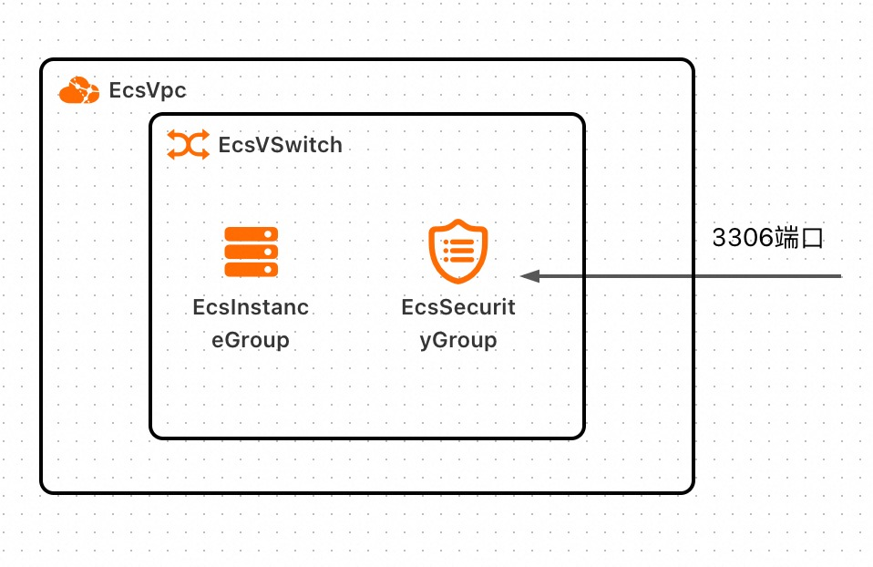
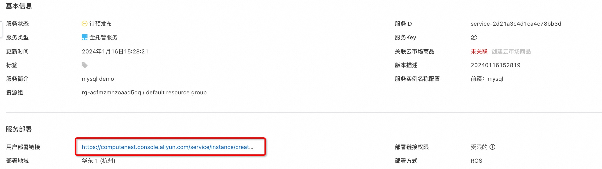
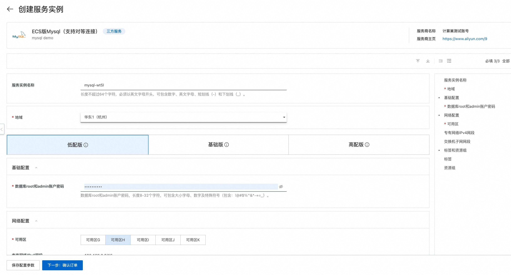
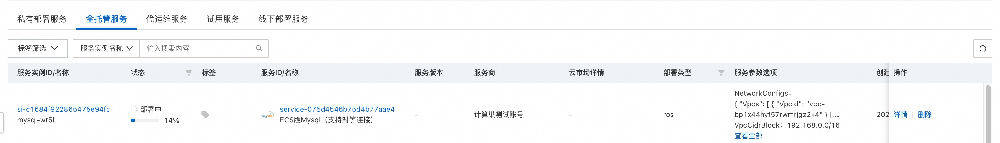
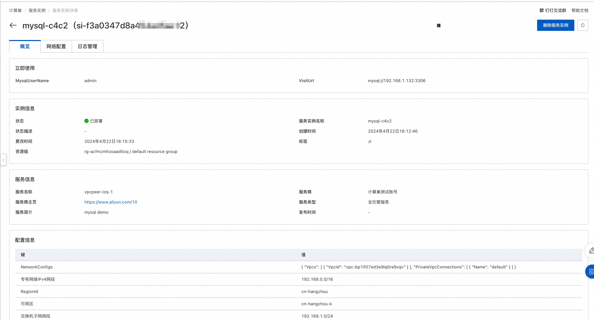
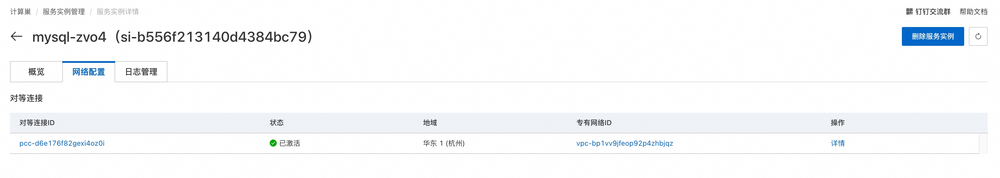
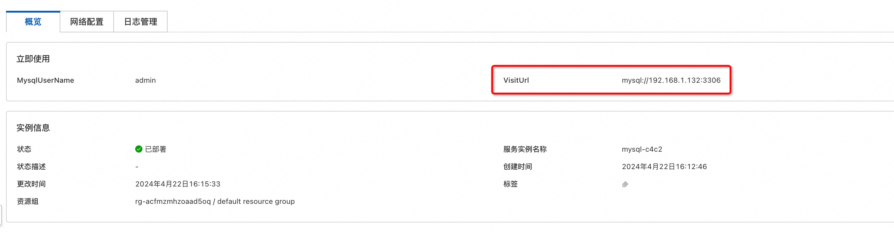
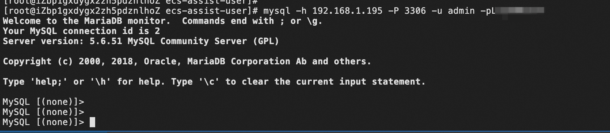

# 服务模版说明文档

## 服务说明

本文介绍基于MySQL软件包快速构建托管版单租户计算巢服务，关于计算巢托管版可以参考[帮助文档](https://help.aliyun.com/zh/compute-nest/create-a-fully-managed-service?spm=a2c4g.11174283.0.i5)，
本示例采用单ECS的架构，并默认开启了VPC对等连接，用户部署服务实例后，可以直接通过内网访问部署在服务商的MySQL，除此之外还配置了三种套餐，分别为：

| 套餐名 |  ECS规格族         | vCPU与内存          | 系统盘               | 公网带宽      |
|-----|----------------|------------------|-------------------|-----------|
| 低配版 |  ecs.c6.large   | 内存型c6，2vCPU 4GiB | ESSD云盘 200GiB PL0 | 固定带宽1Mbps |
| 基础版 |  ecs.c6.xlarge  | 内存型c6，4vCPU 8GiB | ESSD云盘 200GiB PL0 | 固定带宽1Mbps |
| 高配版 |  ecs.c6.2xlarge | 内存型c6，4vCPU 8GiB | ESSD云盘 200GiB PL0 | 固定带宽1Mbps |

本示例对应的git地址：[mysql-managed-vpcpeering-demo](https://github.com/aliyun-computenest/mysql-managed-vpcpeering-demo)

本示例会自动的构建计算巢服务，具体的服务构建流程为:

1. 将MySQL安装包（提前存放到该github repo中）构建为计算巢文件部署物
2. 创建计算巢服务并关联文件部署物

创建过程大约持续3分钟，当服务变成待提交后构建成功

## 部署架构

本部署仅有一台ECS，安全组开放3306端口，每个服务实例将新建Vpc与Vswitch


## 服务构建计费说明

测试本服务构建无需任何费用，创建服务实例涉及的费用参考服务实例计费说明

## RAM账号所需权限

本服务需要对ECS、VPC等资源进行访问和创建操作，若您使用RAM用户创建服务实例，需要在创建服务实例前，对使用的RAM用户的账号添加相应资源的权限。添加RAM权限的详细操作，请参见[为RAM用户授权](https://help.aliyun.com/document_detail/121945.html)
。所需权限如下表所示。

| 权限策略名称                              | 备注                          |
|-------------------------------------|-----------------------------|
| AliyunECSFullAccess                 | 管理云服务器服务（ECS）的权限            |
| AliyunVPCFullAccess                 | 管理专有网络（VPC）的权限              |
| AliyunROSFullAccess                 | 管理资源编排服务（ROS）的权限            |
| AliyunComputeNestUserFullAccess     | 管理计算巢服务（ComputeNest）的用户侧权限  |
| AliyunComputeNestSupplierFullAccess | 管理计算巢服务（ComputeNest）的服务商侧权限 |
| AliyunCDTFullAccess                 | 管理云数据传输（CDT）的权限      |

## 服务实例计费说明

测试本服务在计算巢上的费用主要涉及：

- 所选vCPU与内存规格
- 系统盘类型及容量
- 公网带宽

计费方式包括：

- 按量付费（小时）
- 包年包月

目前提供如下套餐：

| 套餐名 | ECS规格族         | vCPU与内存          | 系统盘               | 公网带宽      |
|-----|----------------|------------------|-------------------|-----------|
| 低配版 | ecs.c6.large   | 内存型c6，2vCPU 4GiB | ESSD云盘 200GiB PL0 | 固定带宽1Mbps |
| 基础版 | ecs.c6.xlarge  | 内存型c6，4vCPU 8GiB | ESSD云盘 200GiB PL0 | 固定带宽1Mbps |
| 高配版 | ecs.c6.2xlarge | 内存型c6，4vCPU 8GiB | ESSD云盘 200GiB PL0 | 固定带宽1Mbps |

预估费用在创建实例时可实时看到。

## 部署流程

### 部署参数说明

| 参数族  | 参数项               | 说明                                                                          |
|------|-------------------|-----------------------------------------------------------------------------|
| 基础配置 | 数据库root和admin账户密码 | 数据库root和admin账户密码，长度8-32个字符，可包含大小字母、数字及特殊符号（包含：!@#$%^&*-+=_）。               |
| 网络配置 | 可用区               | 选择可用区，资源将在服务商的该可用区创建                                                        |
| 网络设置 | 专有网络IPv4网段              | 填写专有网络IPv4网段，建议您使用RFC私网地址作为专有网络的网段如10.0.0.0/8，172.16.0.0/12，192.168.0.0/16。 |                                                              |
| 网络设置 | 交换机子网网段           | 填写交换机子网网段                                                                   |

### 部署步骤

0. 部署链接
   
1. 单击部署链接，进入服务实例部署界面，根据界面提示，填写参数完成部署。
   
   网络配置部分填入新建VPC的IPV4网段与交换机子网网段。
   如果需要创建对等连接，这里还需要填写网络配置，网络设置部分填写对等连接的用户侧VPC。
   需要注意VPC的网段不可以与新建VPC网段重叠。
   
2. 参数填写完成后可进入订单确认页。
   
3. 确认订单完成后同意服务协议并点击**立即创建**
   进入部署阶段。
   

   
4. 等待部署完成后就可以开始使用服务。
   
   网络配置已有对等连接内容（用户在创建服务实例页选择开启VPC对等连接才会显示）。
   
5. 使用服务，本服务支持VPC对等连接，租户可以通过VPC对等连接实现私网访问，租户私网访问流程：
    1. 在服务实例详情 - 立即使用，可以看到私网IP地址，连接时可以通过IP地址进行访问
       
    2. 在对应的vsw中创建ECS，创建好后安装mysql客户端
   ```
   yum install mysql
   or
   apt install mysql-client
   ```
    3. 在该ECS中连接MySQL，用IP进行连接：
        

## 服务详细说明

本文提前将MySQL社区版安装包存放到该Github Repo中，构建服务过程中会将该安装包发布为计算巢部署物，并在ROS模板写入安装指令，ROS模板引擎在执行时便会自动执行安装了。

```bash
wget '{{ computenest::file::MySQL }}' -O mysql-community-release-el6-5.noarch.rpm
rpm -ivh mysql-community-release-el6-5.noarch.rpm
yum repolist all | grep mysql
yum install mysql-community-server -y
```

{{ computenest::file::MySQL }} 为占位符，会由计算巢服务替换成文件部署物MySQL的http下载地址

文件说明

| 文件路径                                              | 说明                                                                                                                   |
|---------------------------------------------------|----------------------------------------------------------------------------------------------------------------------|
| config.yaml                                       | 构建服务的配置文件，服务构建过程中会使用计算巢命令行工具[computenest-cli](https://pypi.org/project/computenest-cli/)，computenest-cli会基于该配置文件构建服务 |
| parameters.yaml                                   | 本服务为托管版单租，使用该文件渲染服务商需要配置的网络参数，包括VpcId，VSwitch等                                                                       |
| artifact/mysql-community-release-el6-5.noarch.rpm | MySQL社区版安装包，构建过程会将该包发布为计算巢部署物                                                                                        |
| icons/service_logo.jpg                            | 构建服务默认的图标                                                                                                            |
| templates/parameters.yaml                         | 本服务为托管版单租服务，所以只需要用户填写一部分参数，通过该文件指定用户所填参数                                                                             |
| templates/template.yaml                           | ROS模板文件，ROS模板引擎根据该模板能够自动创建出所有的资源                                                                                     |

templates/template.yaml主要由三部分组成

1. Parameters定义需要用户填写的参数，包括付费类型，实例规格，Ipv4网段，交换机子网网段和实例密码可用区参数

```
ZoneId:
 Type: String
 AssociationProperty: ALIYUN::ECS::Instance:ZoneId
 Label:
   en: VSwitch Available Zone
   zh-cn: 可用区
# 数据库root账户密码
Password:
 # 查询该参数时只输出星号（*）
 NoEcho: true
 Type: String
 Description:
   en: 'Database root account passwor, 8-32 characters, including uppercase and lowercase letters, numbers and special symbols (including: !@#$%^&*-+=_).'
   zh-cn: 数据库root账户密码，长度8-32个字符，可包含大小字母、数字及特殊符号（包含：!@#$%^&*-+=_）。
 Label:
   en: Root Account Password
   zh-cn: 数据库root账户密码
 ConstraintDescription:
   en: '8-32 characters, including uppercase and lowercase letters, numbers and special symbols (including: !@#$%^&*-+=_).'
   zh-cn: 8-32个字符，可包含大小字母、数字及特殊符号（包含：!@#$%^&*-+=_）。
 MinLength: '8'
 MaxLength: '32'
 AssociationProperty: ALIYUN::ECS::Instance::Password
# 新建Ipv4网段
VpcCidrBlock:
  Type: String
  Label:
    en: VPC CIDR IPv4 Block
    zh-cn: 专有网络IPv4网段
  Description:
    zh-cn: VPC的ip地址段范围，<br>您可以使用以下的ip地址段或其子网:<br><font color='green'>[10.0.0.0/8]</font><br><font
      color='green'>[172.16.0.0/12]</font><br><font color='green'>[192.168.0.0/16]</font>
    en: 'The ip address range of the VPC in the CidrBlock form; <br>You can use
        the following ip address ranges and their subnets: <br><font color=''green''>[10.0.0.0/8]</font><br><font
        color=''green''>[172.16.0.0/12]</font><br><font color=''green''>[192.168.0.0/16]</font>'
  AssociationProperty: ALIYUN::VPC::VPC::CidrBlock
  Default: 192.168.0.0/16
# 新建交换机网段
VSwitchCidrBlock:
  Type: String
  Label:
    en: VSwitch CIDR Block
    zh-cn: 交换机子网网段
  Description:
    zh-cn: 必须属于VPC的子网段。
    en: Must belong to the subnet segment of VPC.
  AssociationProperty: ALIYUN::VPC::VSwitch::CidrBlock
  AssociationPropertyMetadata:
    VpcCidrBlock: VpcCidrBlock
  Default: 192.168.1.0/24
# Ecs实例类型
EcsInstanceType:
 Type: String
 Label:
   en: Instance Type
   zh-cn: Ecs实例类型
 AssociationProperty: ALIYUN::ECS::Instance::InstanceType
 AllowedValues:
   - ecs.c6.large
   - ecs.c6.xlarge
   - ecs.c6.2xlarge
   - ecs.c6.4xlarge
```

2. Resources定义需要开的资源，包括新建的Vpc、VSwitch、ECS。

```
# Vpc
EcsVpc:
  Type: ALIYUN::ECS::VPC
  Properties:
    CidrBlock:
      Ref: VpcCidrBlock
    VpcName:
      Ref: ALIYUN::StackName
# 交换机
EcsVSwitch:
  Type: ALIYUN::ECS::VSwitch
  Properties:
    ZoneId:
      Ref: ZoneId
    VpcId:
      Ref: EcsVpc
    CidrBlock:
      Ref: VSwitchCidrBlock
EcsSecurityGroup:
 Type: 'ALIYUN::ECS::SecurityGroup'
 Properties:
   VpcId:
     Ref: VpcId
   SecurityGroupIngress:
     - Priority: 1
       PortRange: 3306/3306
       NicType: internet
       SourceCidrIp: 0.0.0.0/0
       IpProtocol: tcp
# Ecs实例
EcsInstanceGroup:
 Type: ALIYUN::ECS::InstanceGroup
 Properties:
   # I/O优化实例
   IoOptimized: optimized
   ZoneId:
     Ref: ZoneId
   DiskMappings:
     - Category: cloud_essd
       Device: /dev/xvdb
       Size: 200
   SystemDiskSize: 40
   # cloud-init执行用户命令
   # /var/log/cloud-init.log /var/log/cloud-init-output.log 可以看到执行日志
   # /var/lib/cloud/instance/scripts/part-001 为具体的脚本 可以sh 执行来排查问题
   UserData:
     Fn::Sub:
       - |
         #!/bin/sh

         # sleep一段时间确保网络就绪
         sleep 10

         # 以下省略，具体可以看templates/template.yaml
   # 付费方式：按量付费
   InstanceChargeType: PostPaid
   MaxAmount: 1
   # 系统盘类型：cloud_essd
   SystemDiskCategory: cloud_essd
   # 实例名称
   InstanceName:
     Ref: ALIYUN::StackName
   VpcId:
     Ref: VpcId
   SecurityGroupId:
     Ref: EcsSecurityGroup
   VSwitchId:
     Ref: VSwitchId
   # 指定CentOS 7.9镜像，如果修改镜像，UserData脚本需要进行适配
   ImageId: "centos_7_9_x64_20G_alibase_20220727.vhd"
   InstanceType:
     Ref: EcsInstanceType
   # 主机名
   HostName:
     Ref: ALIYUN::StackName
   # Ecs登录密码
   Password:
     Ref: Password
   # 是否为实例分配公网IP
   AllocatePublicIP: true
   InternetMaxBandwidthOut: 1
```

3. Outputs定义需要最终在计算巢概览页中对用户展示的输出

```
Outputs:
  MysqlUserName:
    Label: MySQL登录用户名
    Value: admin
  PrivateIps:
    Label: 私网Ip地址
    Value:
      Fn::Select:
        - 0
        - Fn::GetAtt:
            - EcsInstanceGroup
            - PrivateIps
```

## 服务配置

[创建代运维服务完成实例运维](https://help.aliyun.com/zh/compute-nest/create-a-hosted-operations-and-maintenance-service?spm=a2c4g.11186623.0.i24#task-2167552])

[创建包含变配功能的服务](https://help.aliyun.com/zh/compute-nest/use-cases/create-a-service-that-supports-specification-changes-and-change-the-specifications-of-a-service-instance?spm=a2c4g.11186623.0.i3])

[创建包含服务升级功能的服务](https://help.aliyun.com/zh/compute-nest/upgrade-a-service-instance?spm=a2c4g.11186623.0.i17#task-2236803)

## 服务交付

[自定义服务架构图](https://help.aliyun.com/zh/compute-nest/customize-a-service-architecture?spm=a2c4g.11186623.0.0.56e736bfyUdlFm])

[服务文档上线流程](https://help.aliyun.com/zh/compute-nest/use-cases/publish-documents-to-compute-nest?spm=a2c4g.313309.0.i0])

[将服务上架云市场并上到云市场售卖](https://help.aliyun.com/zh/compute-nest/publish-a-service-to-alibaba-cloud-marketplace?spm=a2c4g.11186623.0.i7])
